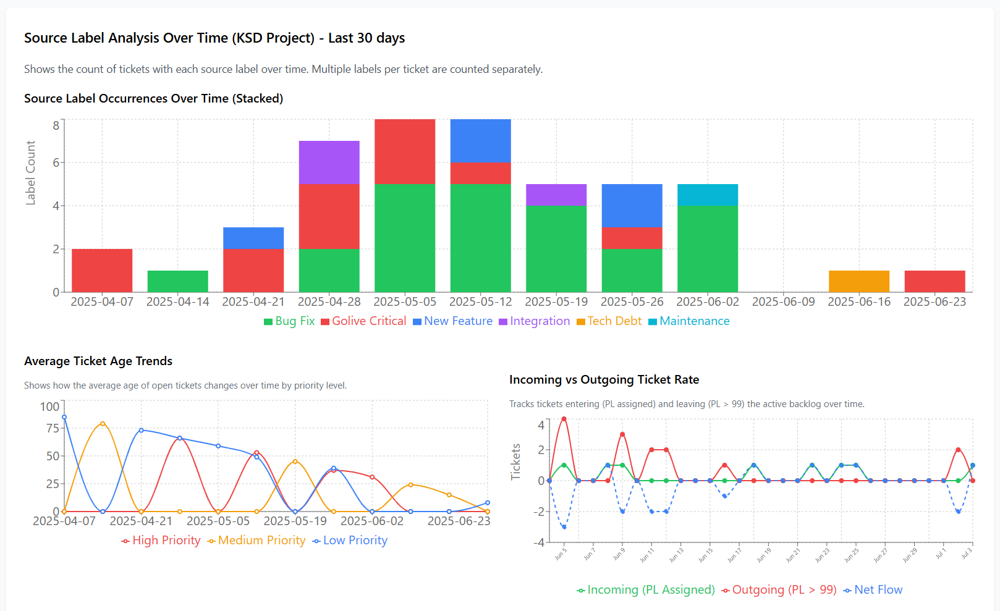

# Jira Analytics Dashboard

A modular React application that provides analytics and visualizations for Jira tickets. Built with Express.js backend and modern React frontend with Vite build system.

## Dashboard Preview



*Example of the analytics dashboard showing priority distribution, backlog trends, source label analysis, and recent tickets*

## Features

- **🎯 Time in Top 7 Tracking**: Tracks how long tickets have been prioritized (since first Priority Level assignment) rather than total age since creation
- **Modular Component Architecture**: Clean separation of concerns with single-responsibility components
- **Modern React Build System**: Vite for fast development and optimized production builds
- **Configuration-Driven Dashboard**: Easy content modification through centralized configuration
- **Dynamic Rendering**: Sections can be enabled/disabled without code changes
- **Time Period Controls**: View data for 7d, 30d, 90d, 180d, 365d, or custom periods
- **Time Interval Options**: Aggregate data daily, weekly, or monthly
- **Priority Analytics**: Visualize tickets by priority levels (High <10, Medium <100, Low ≥100)
- **Source Label Tracking**: Monitor tickets by source labels (src-bug-fix, src-golive-critical, etc.)
- **Interactive Tooltips**: Hover over charts to see detailed ticket information with clickable Jira links
- **Transition History**: Complete tracking of status changes, priority updates, and label modifications
- **Persistent Credentials**: API tokens saved locally for convenience
- **Smart Data Caching**: Preserves historical data and merges new information intelligently
- **Developer Tools**: Built-in logging, debugging, and data export capabilities
- **Comprehensive Testing**: 36 tests covering frontend, backend, and end-to-end functionality

## Quick Start

### 1. Installation

```bash
npm install
```

### 2. Get Jira API Token

To connect to your Jira instance, you'll need an API token:

1. **Log into Jira** at your organization's Jira URL (e.g., `https://yourcompany.atlassian.net`)

2. **Go to Account Settings**:
   - Click your profile picture in top-right corner
   - Select "Account settings" or "Manage account"

3. **Create API Token**:
   - Navigate to the "Security" tab
   - Click "Create and manage API tokens"
   - Click "Create API token"
   - Give it a descriptive name (e.g., "Jira Analytics Dashboard")
   - **Copy the token immediately** - you won't be able to see it again

4. **Note Your Details**:
   - Your Jira base URL (e.g., `https://yourcompany.atlassian.net`)
   - Your email address (used as username)
   - The API token you just created

### 3. Run the Application

**Development Mode** (recommended - with hot reload):
```bash
npm run dev
```
This starts both the API server (port 3001) and the React client (port 3000) with hot reload.

**Production Mode**:
```bash
# First, build the client (required)
npm run build

# Then start the server (serves built files from dist/)
npm start
```
Builds the optimized client bundle and starts the API server on port 3001. **Note**: The build step is required for production mode to work correctly.

**Individual Services**:
```bash
# API server only
npm run server

# React client only (development)
npm run client

# Preview built files (alternative to npm start)
npm run preview
```

### 4. Access the Dashboard

**Development**: Open http://localhost:3000  
**Production**: Open http://localhost:3001

Then:
1. Enter your Jira base URL
2. Enter your email address
3. Enter your API token
4. Select your project key
5. Click "Fetch Data"

## Architecture

### Modular Component Structure

```
/src/
├── components/
│   ├── panels/               # Dashboard panel components
│   │   ├── OverviewPanel.jsx
│   │   ├── TrendsPanel.jsx
│   │   ├── SourcesPanel.jsx
│   │   └── TicketsPanel.jsx
│   ├── tooltips/             # Chart tooltip components
│   │   ├── CustomTooltip.jsx
│   │   ├── SourceLabelsTooltip.jsx
│   │   └── CustomAgeTooltip.jsx
│   ├── ui/                   # UI utility components
│   │   ├── ConnectionStatus.jsx
│   │   ├── ConfigPanel.jsx
│   │   ├── DevPanel.jsx
│   │   └── LogsPanel.jsx
│   ├── icons/                # SVG icon components
│   │   └── Icons.jsx
│   └── DashboardRenderer.jsx # Dynamic dashboard orchestrator
├── config/
│   └── dashboardConfig.js    # Centralized configuration
├── utils/
│   ├── logger.js             # Enhanced logging system
│   ├── api.js                # API utilities
│   └── helpers.js            # Helper functions
├── hooks/
│   └── useJiraData.js        # Data management custom hook
├── styles/
│   └── styles.css            # Global styles
├── App.jsx                   # Main application component
├── main.jsx                  # React entry point
└── index.html                # HTML template
```

### Benefits for Maintainability

- **Single Responsibility**: Each component has one clear purpose
- **Semantic Naming**: File names clearly indicate their content
- **Logical Grouping**: Related components organized in folders
- **Clear Dependencies**: Import/export statements show relationships
- **Easy Claude Code Updates**: Small, focused files are easier to understand and modify

### Build System

- **Vite**: Fast development server with hot module replacement
- **React 18**: Modern React with concurrent features
- **Recharts**: Chart library loaded globally for compatibility
- **Tailwind CSS**: Utility-first CSS framework via CDN
- **ESM Modules**: Modern JavaScript module system

## Configuration

The app automatically detects and uses these Jira configurations:

- **Custom Field**: `customfield_11129` for Priority Level
- **Priority Categories**:
  - High: Priority Level < 10
  - Medium: Priority Level < 100  
  - Low: Priority Level ≥ 100
  - Unknown: No Priority Level set
- **Source Labels**: Only labels prefixed with "src-" are analyzed
- **Time in Top 7**: Tracks from when Priority Level is first assigned (`incomingDate`) rather than ticket creation date

## Data Storage

All data is stored locally in the `/data` directory:

- `config.json` - Your Jira connection settings
- `tickets.json` - Current ticket data with full transition history
- `historical.json` - Time series data for charts

## Development

### Adding New Components

1. **Create the component** in the appropriate directory:
   ```jsx
   // src/components/panels/NewPanel.jsx
   import React from 'react'
   
   export const NewPanel = ({ realData, jiraConfig }) => {
     if (!realData) return null
     return (
       <div className="chart-container p-6">
         <h3 className="text-lg font-semibold mb-4">New Panel</h3>
         {/* Your content */}
       </div>
     )
   }
   ```

2. **Register in DashboardRenderer**:
   ```jsx
   // src/components/DashboardRenderer.jsx
   import { NewPanel } from './panels/NewPanel'
   
   case 'NewPanel':
     return <NewPanel key={section.id} {...commonProps} />
   ```

3. **Add to configuration**:
   ```jsx
   // src/config/dashboardConfig.js
   { id: 'new', title: 'New Panel', component: 'NewPanel', enabled: true }
   ```

### Modifying Configuration

Edit `src/config/dashboardConfig.js` to:
- Enable/disable dashboard sections
- Change chart colors and dimensions
- Modify source label definitions
- Update card configurations

### Development Workflow

1. **Start development server**: `npm run dev`
2. **Make changes** to components in `/src`
3. **Hot reload** automatically updates the browser
4. **Use developer tools** (🔧 Dev button) for debugging
5. **Check logs panel** (📋 Logs button) for errors
6. **Export data/logs** for troubleshooting

## Testing and Debugging

### Automated Test Suite

Run comprehensive tests covering Time in Top 7 functionality:
```bash
npm test                    # Run all 36 tests
npm run test:watch         # Run tests in watch mode
npm run test:coverage      # Run with coverage report
npm test tests/frontend/   # Frontend component tests only
npm test tests/integration/ # Integration tests only
```

**Test Coverage:**
- Frontend components (Time in Top 7 UI updates)
- Backend calculation logic (incoming date tracking)
- End-to-end integration (data flow verification)
- Edge cases and error handling

### Developer Panel Features

Access via the **🔧 Dev** button:
- **Quick Actions**: Clear data, trigger errors, test loading states
- **Data Export**: Download configuration, current data, or debug logs
- **System Info**: Real-time status of React, charts, data, and errors

### Debug Logging

Access via the **📋 Logs** button:
- **Categorized Logs**: INIT, API, STATE, PERFORMANCE, ERROR
- **Real-time Streaming**: Live updates as actions occur
- **Export Capability**: Download logs for analysis
- **Session Persistence**: Logs stored in browser session

### For Claude Debugging

When reporting issues:
1. **Open Debug Logs** panel to capture relevant information
2. **Export logs** using the developer panel
3. **Include error details** and steps to reproduce

## Troubleshooting

### Common Issues

**"EADDRINUSE: address already in use"**
```bash
# Kill existing server
lsof -ti:3001 | xargs kill -9
lsof -ti:3000 | xargs kill -9
npm run dev
```

**"401 Unauthorized"**
- Verify your email and API token are correct
- Ensure your API token has permission to access the project
- Check that your Jira base URL is correct

**"No tickets found"**
- Verify the project key exists and you have access
- Check that tickets have the Priority Level custom field set
- Try adjusting the time period (some projects may have older tickets)

**"Charts not loading"**
- Check browser console for JavaScript errors
- Ensure Recharts library loaded correctly
- Try refreshing the page

**"npm start shows blank page"**
- Make sure you ran `npm run build` first to create the dist/ folder
- Check that the server console shows "Serving static files from: dist"
- For development, use `npm run dev` instead

### API Token Permissions

Your API token needs:
- Read access to Jira projects
- Permission to view issue details and history
- Access to custom fields (specifically Priority Level field)

### Build Issues

**Dependencies not installing**:
```bash
rm -rf node_modules package-lock.json
npm install
```

**Vite build failing**:
```bash
npm run build
# Check console output for specific errors
```

## Security

- API tokens are stored locally only
- Tokens are masked in the UI
- No credentials are logged or transmitted to external services
- All data remains on your local machine
- Data files are excluded from version control via .gitignore

## Support

For issues or questions:
1. **Check the debug logs panel** for error details
2. **Export logs** and include them when reporting issues
3. Verify your Jira API token and permissions
4. Ensure your Jira instance is accessible