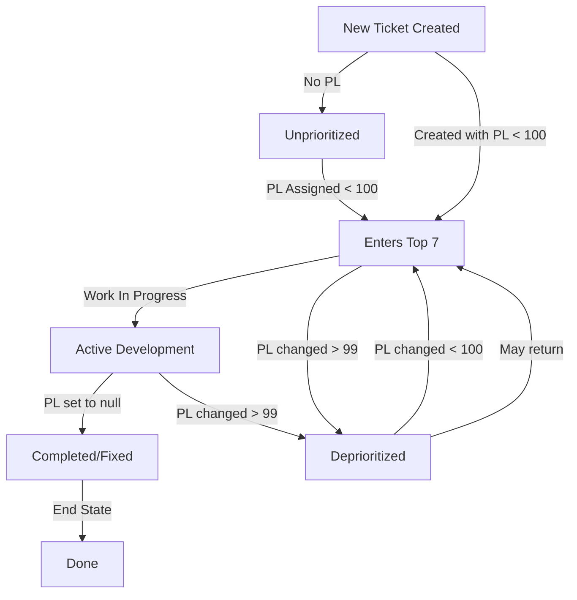

# Top 7 Business Logic & Workflow Documentation

## Executive Summary
The "Top 7" system is a prioritization methodology for managing the most critical development work in an active sprint or development cycle. This document explains the business logic, state transitions, and workflow that drives the Jira Analytics Dashboard.

## Table of Contents
- [What is "Top 7"?](#what-is-top-7)
- [Priority Level System](#priority-level-system)
- [State Transitions](#state-transitions)
- [Business Workflow](#business-workflow)
- [Ticket Dependencies](#ticket-dependencies)
- [Analytics Interpretation](#analytics-interpretation)
- [Common Scenarios](#common-scenarios)
- [FAQ](#frequently-asked-questions)

## What is "Top 7"?

### Business Definition
The "Top 7" represents the **active prioritized backlog** - the most important tickets that teams should focus on at any given time. While named "Top 7", it's not limited to exactly 7 tickets but represents the concept of maintaining focus on a manageable set of high-priority work.

### Why "Top 7"?
- **Focus**: Limits work in progress (WIP) to maintain team efficiency
- **Visibility**: Clear understanding of what's most important
- **Accountability**: Tracks how long critical items have been waiting
- **Prioritization**: Forces explicit decisions about what matters most

### Key Concept: Time in Top 7
Instead of tracking total ticket age (time since creation), we track **Time in Top 7** - how long a ticket has been in the prioritized backlog. This provides more meaningful metrics about actual work queue management.

## Priority Level System

### Overview
Priority Level (PL) is a custom Jira field (`customfield_11129`) that determines a ticket's position in the prioritization queue.

### Priority Level Ranges

| Priority Level | Category | Business Meaning | Dashboard Color |
|---------------|----------|------------------|-----------------|
| **1-9** | Critical/Emergency | Immediate action required, drop everything | Red |
| **10-99** | Top 7 Active | In active prioritized backlog | Orange/Yellow |
| **100-999** | Future/Backlog | Deprioritized, not in active work | Green |
| **null/empty** | Unassigned | Not yet prioritized OR completed | Gray |

### Key Thresholds
- **PL < 100**: Ticket is "in Top 7" (active prioritized backlog)
- **PL ≥ 100**: Ticket is "out of Top 7" (deprioritized)
- **PL = null**: Ticket either never entered Top 7 or has been completed

## State Transitions

### Ticket Lifecycle States



### State Transition Rules

#### Entering Top 7
A ticket enters the Top 7 when:
- Priority Level is first assigned (from null to any value < 100)
- Priority Level is changed from ≥100 to <100 (re-prioritized)
- Created with a Priority Level < 100

**Business Trigger**: Product Owner, Tech Lead, or Manager determines ticket is critical enough for immediate attention.

#### Staying in Top 7
A ticket remains in Top 7 while:
- Priority Level remains < 100
- Work is actively progressing
- Dependencies are being resolved

**Time Tracking**: The dashboard tracks days since entering Top 7, helping identify stuck tickets.

#### Leaving Top 7 (Fixed/Resolved)
A ticket leaves the Top 7 through two paths:

1. **Completed (PL → null)**
   - Work is finished
   - Ticket is closed/resolved
   - Priority Level is cleared
   - **Business Meaning**: Success! Work delivered.

2. **Deprioritized (PL → >99)**
   - Moved to future sprint
   - No longer critical
   - Resources needed elsewhere
   - **Business Meaning**: Consciously delayed, not abandoned.

## Business Workflow

### Typical Weekly/Sprint Flow

1. **Sprint Planning**
   - Review current Top 7 tickets
   - Assess new critical issues
   - Assign Priority Levels based on business impact

2. **Daily Prioritization**
   - Check "Time in Top 7" for aging tickets
   - Adjust Priority Levels as needed
   - Identify blockers on long-running Top 7 items

3. **Work Execution**
   - Developers focus on lowest PL numbers first
   - PL 5 worked before PL 20
   - Clear communication when PL changes

4. **Completion/Deprioritization**
   - Completed work: Clear Priority Level (set to null)
   - Deferred work: Set Priority Level > 99
   - Document reason for state change

### Priority Level Assignment Process

```
Who Can Assign:
├── Product Owners (business priority)
├── Tech Leads (technical priority)
├── Engineering Managers (resource allocation)
└── On-call Engineers (incident response)

When to Assign:
├── New critical bugs discovered
├── Customer escalations
├── Sprint planning sessions
├── Incident response
└── Dependency identification
```

## Ticket Dependencies

### How Dependencies Affect Top 7

Dependencies between tickets often drive Priority Level assignments:

1. **Blocking Dependencies**
   - If Ticket A blocks Ticket B (PL 15)
   - Ticket A should get PL < 15 (e.g., PL 10)
   - Ensures dependencies are resolved first

2. **Cascading Priorities**
   ```
   Feature X (PL 20)
   ├── Backend API (PL 18) - Must complete first
   ├── Frontend UI (PL 19)  - Depends on API
   └── Documentation (PL 25) - Can happen after
   ```

3. **Cross-team Dependencies**
   - Platform team ticket (PL 8) blocks 3 app teams
   - Higher impact = lower PL number = higher priority

### Dependency State Transitions

When a blocking ticket is resolved:
1. Blocker ticket: PL → null (completed)
2. Blocked tickets: Review and potentially lower PL (increase priority)
3. New blockers: May enter Top 7 with appropriate PL

## Analytics Interpretation

### Key Metrics

#### Time in Top 7
- **Good**: < 7 days - Healthy flow
- **Warning**: 7-14 days - May need attention
- **Critical**: > 14 days - Likely blocked or mis-prioritized

#### Average Time by Priority Category
- **High Priority (PL < 10)**: Should average < 3 days
- **Medium Priority (PL 10-50)**: Target < 7 days
- **Low Priority (PL 51-99)**: Acceptable up to 14 days

#### Fixed Tickets Chart
Shows tickets leaving Top 7 over time:
- **Steady flow**: Healthy completion rate
- **Spikes**: Sprint ends or major releases
- **Drops**: Team capacity issues or blockers

### Dashboard Panels Explained

1. **Overview Panel**
   - Current Top 7 composition
   - Maximum time for each priority category
   - Quick health check of backlog

2. **Tickets Panel**
   - Detailed list sorted by Time in Top 7
   - Identifies oldest items needing attention
   - Shows actual PL values for planning

3. **Sources Panel**
   - Distribution by source labels (bug, feature, tech-debt)
   - Helps balance different work types
   - Trends show changing priorities

4. **Fixed Tickets Panel**
   - Completion velocity over time
   - Both cleared (done) and deprioritized (deferred)
   - Indicates team throughput

## Common Scenarios

### Scenario 1: Critical Bug Discovered
```
1. Bug reported by customer
2. Severity assessed as High
3. PL assigned = 5 (enters Top 7)
4. Developer assigned immediately
5. Fix deployed in 2 days
6. PL cleared (null) - exits Top 7 as "Fixed"
```

### Scenario 2: Feature Deprioritization
```
1. Feature in Top 7 with PL = 45
2. Time in Top 7 reaches 10 days
3. Sprint planning reveals higher priorities
4. PL changed to 150 (exits Top 7)
5. Will revisit next sprint
```

### Scenario 3: Dependency Chain
```
1. Mobile app feature needs API (PL = 30)
2. API needs database migration (PL = 25)
3. Migration needs maintenance window (PL = 20)
4. Work proceeds in PL order: 20 → 25 → 30
```

### Scenario 4: Escalation Path
```
1. Ticket sitting at PL = 85 for 5 days
2. Customer escalates to management
3. PL changed to 15 (high priority)
4. Enters active development immediately
```

## Frequently Asked Questions

### Q: Why track "Time in Top 7" instead of total age?
**A**: Total age includes time before prioritization. A ticket could be months old but only recently became critical. Time in Top 7 shows how long we've known something was important but haven't completed it - a more actionable metric.

### Q: What if we have more than 7 critical items?
**A**: "Top 7" is conceptual, not literal. You might have 10-15 items with PL < 100. The key is maintaining focus and actively managing the prioritized backlog size.

### Q: Why is PL 100 the cutoff?
**A**: It's a clear, memorable threshold:
- 1-99: Two-digit "active" range with 99 possible priorities
- 100+: Three-digit "future" range for deprioritized work
- Provides enough granularity while remaining manageable

### Q: Can Priority Levels change automatically?
**A**: No, PL changes are manual and deliberate. This ensures conscious prioritization decisions with accountability.

### Q: What's the difference between PL = null and PL > 99?
**A**: 
- **PL = null**: Work completed or never prioritized
- **PL > 99**: Consciously deprioritized but still tracked

### Q: How often should we review Priority Levels?
**A**: 
- Daily: Check items > 7 days in Top 7
- Weekly: Team review of all Top 7 items
- Sprint boundary: Full reprioritization

### Q: What if a ticket's Jira status is "Done" but PL isn't cleared?
**A**: This indicates a process issue. The dashboard tracks PL transitions, not status. Teams should clear PL when work completes to maintain accurate metrics.

### Q: How do we handle recurring work?
**A**: Each instance gets its own ticket and PL assignment. This maintains clear Time in Top 7 tracking for each work item.

## Best Practices

### DO:
- ✅ Review Time in Top 7 daily for aging tickets
- ✅ Clear Priority Level when work completes
- ✅ Use consistent PL ranges across teams
- ✅ Document reason when deprioritizing (PL > 99)
- ✅ Assign lower PL to blocking dependencies

### DON'T:
- ❌ Leave completed tickets in Top 7 (clear the PL)
- ❌ Use Priority Level as a general ranking system
- ❌ Change PL without team communication
- ❌ Let tickets age > 14 days without review
- ❌ Ignore dependency chains when setting PL

## Integration with Development Process

### Agile/Scrum Teams
- Top 7 aligns with Sprint goals
- PL assignments during Sprint planning
- Daily standup includes Top 7 review
- Sprint review shows Fixed Tickets metrics

### Kanban Teams
- Top 7 represents "Ready" column limit
- PL drives pull order
- WIP limits align with Top 7 capacity
- Continuous flow metrics from Time in Top 7

### DevOps/SRE Teams
- Incidents get immediate low PL (1-9)
- Post-incident items enter Top 7
- Toil reduction tracks via Time in Top 7
- On-call can assign PL directly

## Conclusion

The Top 7 system provides a clear, measurable way to manage development priorities. By tracking Time in Top 7 rather than total age, teams can:

1. **Focus** on what truly matters
2. **Measure** actual prioritization effectiveness
3. **Identify** bottlenecks and aging work
4. **Balance** different work types
5. **Communicate** priorities clearly

The Priority Level field serves as the single source of truth for what's actively being worked on, enabling data-driven decisions about resource allocation and sprint planning.

Remember: The goal isn't to minimize Time in Top 7 at all costs, but to maintain a healthy, flowing backlog where critical work gets completed in a predictable timeframe.